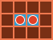

# Entraîner des agents à aller sur des cases d'eau

## Introduction

Le but en ce moment, c'est d'essayer de survivre plus de 100 tours. Pour ça, il faut apprendre aux robots à aller chercher de la glace, à la récupérer, et à la rapporter aux usines. Commençons par le commencement, et essayons de mettre tous les robots sur des cases d'eau. Une telle tâche devrait pas être trop compliquée. Plus précisément, c'est assez trivial de résoudre la tâche en codant à la main : on trouve pour chaque robot la case d'eau vide la plus proche et on se rapproche si on ne va pas collisionner avec un autre robot. 

Essayons de faire ça en RL. 

## Représentation des stratégies par réseaux de neurones

Comme nous l'a appris l'expérience du communisme en URRS, la planification cntralisée de la production, c'est compliqué. 

Plus précisément, créer un réseau de neurones centrale qui coordone le mouvement de tous les robots, c'est plus compliqué que de donner à chaque robot un mini-réseau de neurones qui va se charger de sa survie individuelle. En effet, si chaque robot parvient à survivre, alors on aura réussi notre mission d'éviter les collisions entre robots. 

On donne donc à chaque robot un petit réseau de neurone. Les poids de ces réseaux de neurones sont partagés entre tous les robots, mais les observations sont unique pour chaque robot. Ainsi, chaque robot observe (entre autre) la carte et les autre robots autour de sa position. 

Pour des raisons d'efficacité de calcul, tous ces petits réseaux de neurones sont représentés par un seul gros réseau de neurone totalement convolutionnel, mais ça marche pareil qu'un réseau de neurone pour chaque robot.

## Fonction de reward

La fonction de reward est dans un premier temps très simple : -1 quand le robot meurt et +0.1 quand il est sur une case de glace.   

## Entraînement et résultats

Une telle procédure d'entraînement permet aux robots de se diriger vers des patchs d'eau. Mais tous les patchs d'eau ne sont pas occupés par des robots et les robots ne restent jamais longtemps sur des petits patchs d'eau si il y a d'autres robots aux alentours. On observe aussi que les robots ont la bougeotte : une fois sur un patch de glace, ils ne s'arrêtent pas bien gentillement, mais ils bougent à tous les tours, quitte à échanger leur place avec le robot d'à côté. Ça semble un peu étrange, mais essayons d'expliquer ce phénomène. 

# Comportements belliqueux

## Explications

Il est important de retenir ici que les robots agissent de manière indépendante et cherchent à maximiser leur espérance de gain.

Prenons la situation suivante : deux robots (alliés, mais ça n'a pas d'importance) sur deux cases d'eau adjacentes et cherchons à décrire leur espérance de gain. 

Prenons le point de vue d'un des deux robots. Voici le tableau des reward pour une step que j'obtiens en fonction de ce que l'autre robot fait :

||||
|-:|:-:|:-:|
||**Si il bouge**| **Si il reste en place**   |
|**Si je bouge**|0.1|0.1|
|**Si je reste en place**|-1|0.1|

Notons cependant que si je survis à ce tour, alors je peux répéter la stratégie et espérer gagner $\gamma$ fois ce tableau, puis $\gamma^2$, puis $\gamma^3$... Cela se résume donc par le tableau suivant :

||||
|-:|:-:|:-:|
||**Si il bouge**| **Si il reste en place**   |
|**Si je bouge**|$\frac{0.1}{1-\gamma}$|$\frac{0.1}{1-\gamma}$|
|**Si je reste en place**|$-1$|$\frac{0.1}{1-\gamma}$|

Ici, on remarque que si on ne sait pas ce que l'autre robot fait (ce qui est le cas car le choix d'action pour un robot est indépendant du choix pour les autres robots) alors il est toujours avantageux de choisir de bouger : mieux vaux tuer l'autre robot en lui marchant dessus que de risque de mourir en ne faisant rien.

On peut essayer de mitiger ce comportement en "partageant" les rewards. C'est à dire que si un robot meurt, on pénalise à la fois le robot qui meurt et le robot qui tue. Dans ce cas, la matrice devient la suivante :

||||
|-:|:-:|:-:|
||**Si il bouge**| **Si il reste en place**   |
|**Si je bouge**|$\frac{0.1}{1-\gamma}$|$\frac{0.1}{1-\gamma}-1$|
|**Si je reste en place**|$-1$|$\frac{0.1}{1-\gamma}$|

Ici, on remarque que la situation est un peu plus compliquée : si on est certain que l'autre robot ne va pas bouger, alors il est plus avantageux de ne pas bouger aussi. L'autre extrême est le parfait inverse : si on sait que l'autre robot va bouger, alors il est plus avantageux pour nous aussi de bouger. On peut parfaitement quantifier cette obseration de la manière suivante. Soit $p$ est la probabilité que l'autre robot bouge et $p_0 = \frac{1}{2+\frac{0.1}{1-\gamma}}$. Si $p>p_0$ alors en espérance il vaut mieux nous aussi bouger. Mais si $p \leq p_0$ alors en espérance, il vaut mieux rester en place.

Ici, $p_0 = 0.0833$. Or par défaut, le réseau de neurones effectue un arbitrage sur l'a base d'une proba d'à peu près $0.5$. Donc l'entraînement va converger très naturellement vers la situation où tout le monde bouge, jusqu'à ce que mort s'ensuive. 

## Problèmes

En somme, il y a deux situations très mauvaises (un des deux robots bouge et pas l'autre), et deux situations bonnes (les deux robots font la même chose : ils bougent ou ne bougent pas ensemble).

Tomber sur une des deux situations par le hazard de l'optimisation de PPO peut être un choix valide dans cette situation. Mais n'est clairement pas viable sur le temps long : il y a probablement des comportements à forte valeur ajoutée qui nécessitent une grande coopération des robots. Or ici, notre architecture n'est même pas capable de modéliser une distribution où les deux robots font la même chose avec forte probabilité et des choses différente avec faible probabilité. 

Bref, en mon âme et conscience (et parce que j'ai la flemme de décrire proprement une situation qui expliquerait parfaitement la chose), je pense que la distribution qu'on a choisit pour modéliser le comportement des robots (distribution discrète indépendante entre chaque robot) est trop restrictive et mène à des locaux minimums dans l'optimisation par descente de gradient (ce que fait PPO). 

Petite remarque au passage : c'est en gros le même scénario que les distributions gaussiennes dont j'ai parlé au prof et qui mènent aussi à des minimums locaux (ça, je l'ai prouvé).

## Solution

Pour résoudre le problème énoncé plus haut, il faut réussir à paramétriser une distribution dans laquelle les action du robot $i$ ne sont pas indépendantes du robot $j$.

L'approche naïve voudrait paramétriser dirrectement avec un réseau de neurones une distribution sur l'ensemble des combinaisons possibles d'actions pour l'ensemble des robots. Avec $5$ actions par robot (utils/action/move.py) et seulement 30 robots, ça correspond à $5^{30} \approx 10^{21}$ (à comparer avec le nombre d'avogadro). Ça voudrait dire qu'il faut entraîner un réseau de neurones avec près de 10^{21} d'output. C'est clairement infaisable, il faut trouver une meilleur façon de représenter cet espace de distribution énorme.

L'approche des années 2018, c'est d'utiliser un réseau de neurones récurrent : On commence par choisir la distribution d'action du premier robot. Puis on sample pour ce premier robot. On écrit l'action du premier robot dans la map d'observation. Puis on relance le réseau de neurones (ou une partie du réseau de neurone) pour choisir la distribution d'action du deuxième robot. On sample. On écrit l'action. On choisit la distribution du 3eme robot, ... Cette approche  permet à OpenAi five de battre les champions du monde de dota2. 

Il y a deux problèmes. Le premier, c'est qu'on créé artificiellement un ordre entre les robots. Ça peut biaiser les réseau de neurones. Le deuxième problème, c'est que cette approche ressemble beaucoup à "Pixel CNN", une technique pour créer des distribution sur des images (comme ce qu'on cherche à faire) qui a bien marché pendant un temps, mais qui s'est battre à plat de couture par une nouvelle méthode...

L'approche moderne, c'est d'utiliser des modèles de diffusion. Mais ça pose deux nouveaux problèmes. Le premier, c'est que c'est vraiment long de faire tourner un modèle de diffusion (en mode génération) : il faut beaucoup de step de diffusion pour que les distributions soient les bonnes. Le deuxième c'est qu'il n'y a pas de façon efficace de calculer la logprob pour une action donnée. Du coup c'est relou à utiliser avec PPO. Si on peut s'en passer, c'est cool. 

Bref, je vais arrêter de faire le malin, et on va utiliser pixelCNN (une implémentation des méthodes de CFR).